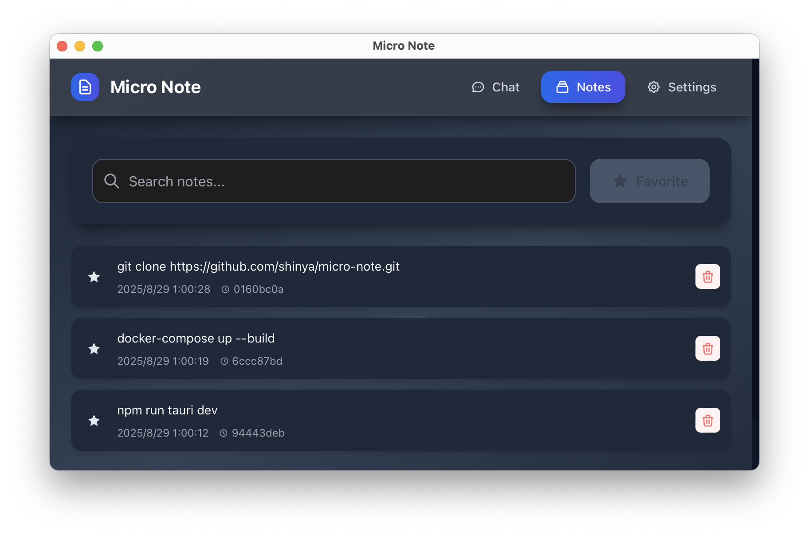

# Micro Note



[日本語版はこちら](README_ja.md)

A desktop application for saving and managing notes with a chat-like UI.

## Features

- **Chat Screen**: Input messages and save them as notes
- **Notes List Screen**: Display saved notes in chronological order
- **Search Function**: Search through note content
- **Favorites Feature**: Mark important notes as favorites
- **Copy Function**: Copy note content to clipboard
- **CSS Customization**: Freely adjust the appearance of the chat UI
- **SQLite Storage**: Persist notes in a local database

## Tech Stack

- **Frontend**: Vue 3 + Vite + Tailwind CSS
- **Backend**: Tauri (Rust)
- **Database**: SQLite
- **Development Environment**: Docker
- **UI**: Modern gradient design + animations

## Setup

### Prerequisites

- Docker
- Docker Compose

### Starting the Development Environment

1. Clone the repository

```bash
git clone https://github.com/shinya/micro-note.git
cd micro-note
```

2. Start Docker containers

```bash
docker-compose up --build
```

3. Access `http://localhost:1420` in your browser

### Local Development

1. Install dependencies

```bash
npm install
```

2. Start the application

```bash
npm run tauri dev
```

## Usage

### Chat Screen

- Enter the content you want to save as a note in the text area
- Press **Enter key** to send the note
- **Shift + Enter** for line breaks
- You can also send using the send button

### Notes List Screen

- Display saved notes in chronological order
- Search notes using the search box
- Register notes as favorites using the favorite button
- Copy note content to clipboard using the copy button

### Settings Screen

- **Preset Themes**: Choose from modern, minimal, and others
- **Custom CSS**: Freely customize the appearance of the chat UI
- **Settings Persistence**: Customized settings are automatically saved
- **Mode Switching**: Toggle dark mode and reverse the chat UI layout

## CSS Customization Examples

### Modern Theme

```css
.chat-message {
  background: linear-gradient(135deg, #667eea 0%, #764ba2 100%);
  color: white;
  border-radius: 20px;
  box-shadow: 0 10px 25px rgba(0, 0, 0, 0.1);
}
```

### Minimal Theme

```css
.chat-message {
  background: #f8fafc;
  border: 1px solid #e2e8f0;
  border-radius: 8px;
  margin: 16px 0;
}
```

## Building

### Desktop Application

```bash
npm run tauri build
```

The built application will be generated in the `src-tauri/target/release/` directory.

### Application Launch

#### Method 1: Launch from Application File

```bash
open /path/to/micro-note/src-tauri/target/release/bundle/macos/Micro\ Note.app
```

#### Method 2: Launch Directly from Terminal

```bash
/path/to/micro-note/src-tauri/target/release/tauri-app
```

#### Method 3: Install from DMG File

1. Double-click `src-tauri/target/release/bundle/dmg/Micro Note_0.1.1_aarch64.dmg`
2. Drag `Micro Note.app` from the mounted disk image to the `Applications` folder
3. Launch `Micro Note.app` from the `Applications` folder

### Troubleshooting

#### When the Application Won't Launch

**Recommended Launch Methods:**

1. **Launch from Terminal** (Most Reliable)

   ```bash
   /path/to/micro-note/src-tauri/target/release/tauri-app
   ```

2. **Launch from Application File**
   - Click "Allow" when the security dialog appears
   - Or check **System Settings** → **Privacy & Security** for blocked application settings

3. **Launch in Development Mode** (For Debugging)
   ```bash
   npm run tauri dev
   ```

**Note:** The application works correctly, but there may be GUI window display issues. We recommend launching from terminal.

## License

MIT License
